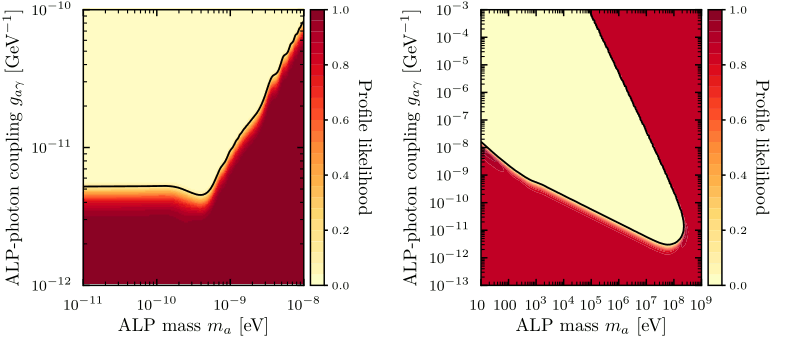

# SNax &mdash; Supernovae and axion-like particle signatures

This is a code for calculating the axion-like particle (ALP) signals from supernovae (SNe). It can currently compute the likelihood for ALP conversions in the Galactic magnetic field and ALP after SN 1987A.

Monte Carlo (MC) routines for ALP decays written by Marie Lecroq, Sebastian Hoof, and Csaba Balazs. Please cite refs [[1,2]](#cosmoalp) when using these.
All other methods written by Lena Schulz and Sebastian Hoof. Please cite ref. [[2]](#update) when using these.

## Summary

Axion-like particles (ALPs) are produced in supernovae and subsequently decay into two photons or convert into photons inside magnetic fields on their way towards Earth. The non-observation of a such photons from the direction of SN 1987A can be used to place limits on the ALP-photon coupling.

We develop MC routines for predicting the number of ALP decay photons for ref. [[1]](#cosmoalp).

In ref. [[2]](#update), we digitise data from refs [[3,4]](#data1) to update the ALP-photon limits based on the temporal information contained in the data. To do so, we develop new quadrature-based integration routines for ALP conversions and decays while also improving on the MC routines developed for for ref. [[1]](#cosmoalp).

## Results

  

The figures above shows the 95% exclusion limit on the ALP-photon coupling obtained from using our updated likelihood in ref. [[2]](#update).

## The code

The code implements an optimised quadrature-based computation of the ALP conversion (requiring the `gammaALPs` package) and decays, in addition to an older brute-force and improved (requiring the Python package `vegas`) MC integration for ALP decays.
The code was developed with Python v3.9.12 and a C++-20-compliant compiler. 

There are a few Python scripts in the [examples folder](examples/) to illustrate how to use the calculation routines.

## References

Please cite refs [[1,2]](#cosmoalp), and the appropriate/relevant other works therein when using our code. Do not hesitate to ask us when unsure about this.

<a id="cosmoalp">[1]</a> Csaba Bal&aacute;zs, Sanjay Bloor, Tom&aacute;s E. Gonzalo, *et al*. [&ldquo;*Cosmological constraints on decaying axion-like particles: a global analysis,*&rdquo;](https://arxiv.org/abs/2205.13549) accepted in JCAP, [[arXiv:2205.13549]](https://arxiv.org/abs/2205.13549).

<a id="update">[2]</a> Sebastian Hoof and Lena Schulz, &ldquo;*Updated constraints on axion-like particles from temporal information in
supernova SN1987A gamma-ray data,*&rdquo; TBA

<a id="data1">[3]</a> E. L. Chupp, W. T. Vestrand, and C. Reppin. [&ldquo;*Experimental Limits on the Radiative Decay of SN 1987A Neutrinos,*&rdquo;](https://doi.org/10.1103/PhysRevLett.62.505) Phys. Rev. Lett. **62**, 505 (1989).

<a id="data2">[4]</a> L. Oberauer, C. Hagner, G. Raffelt, and E. Rieger, [&ldquo;*Supernova bounds on neutrino radiative decays,*&rdquo;](https://doi.org/10.1016/0927-6505(93)90004-W) Astroparticle Physics **1**, 4 (1993), pp. 377&ndash;386.
